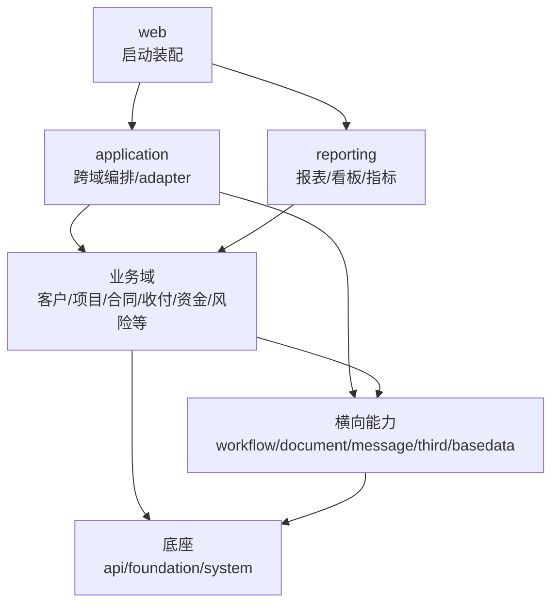

# zswl-mithras 架构索引

本仓库当前包含 39 个后端 Maven 子模块，以及一个前端工程。模块边界正在从“历史物理拆分”收敛为“业务语义清楚、依赖方向明确”的结构。

## 架构文档

- [当前模块地图](docs/module-map.md)：按当前代码重新梳理各模块业务语义、分层、POM 依赖、实际依赖闭包和主要耦合关系。
- [模块依赖审计](docs/module-dependency-audit.md)：记录 POM 直接依赖、主源码实际引用、resources 跨域引用和下一轮治理队列。
- [模块收敛方案](docs/module-consolidation-plan.md)：记录模块是否过细、哪些模块适合保持独立、哪些模块需要依赖瘦身或合并准备，以及已完成的治理动作。
- [模块包名体检](docs/module-package-review.md)：检查各模块内部 package/class 命名、历史命名信号、空目录和后续重构优先级。

## 当前判断

当前不建议为了减少 Maven 数量而立即大规模物理合并模块。更稳妥的方向是：

- 底座和横向能力保持低耦合。
- 业务域之间尽量不直接依赖持久化模型或 mapper。
- 跨域事实装配放在 `zswl-mithras-application`。
- 业务域通过自有 port、snapshot 或稳定 DTO 表达外部输入。
- 等模块语义和依赖方向稳定后，再选择生命周期确实重合的模块做小步物理合并试点。

## 已确认的边界收敛

近期已经落地的模块边界调整如下：

- `zswl-mithras-archives` 保持为档案生命周期模块。档案列表涉及项目基础信息的跨域读模型、档案文件展示/必传统计涉及 `materials_list` 的组合读模型，都已迁到 `zswl-mithras-application`，archives 只通过自有 port 接回查询结果。
- `zswl-mithras-dashboard` 保持为看板与管报聚合模块。它可以作为展示型读模型读取多域事实，但不应承载核心业务规则；`guanbao` 相关历史命名不做表面改名，后续重点是拆清看板聚合、管理报表目录、自研运营报表和观远 BI 适配的职责。
- `zswl-mithras-liquidity` 保持为流动性风险和资金指标读侧模块。外域事实继续通过 snapshot、port 或 application 读模型进入，不把 fund、basedata、collection 等持久化模型带回 liquidity。
- `zswl-mithras-capital` 保持为资金流水与核销域模块。纯资金流水状态、核销明细和同步差异规则正在下沉到 capital；涉及合同、收款、付款、融资、保证金、第三方财资平台的核销编排继续留在 application。
- `zswl-mithras-margin` 保持为保证金域模块。保证金写模型和计划应收维护回收到 margin 自身服务，外部模块优先通过 margin 自有查询/命令接口或 snapshot 消费保证金事实。

## 总体分层

## 推进原则

1. 先基于当前代码证据判断边界，不只看 POM。
2. 低风险模块先做清理，高风险聚合模块先做分析和 port 收敛。
3. 业务域不是不能有交互，而是交互应通过稳定契约，不应互相读取内部表模型。
4. `application` 允许高依赖，但只应承载跨域编排、adapter、事件监听、流程/消息/文档接线。
5. `web` 只负责启动和运行装配。
