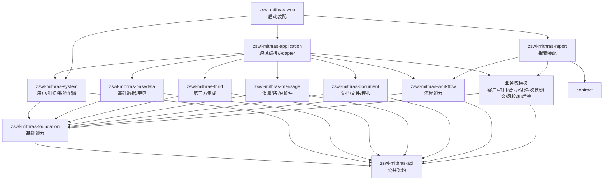
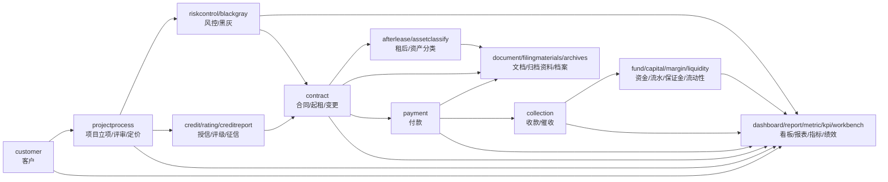
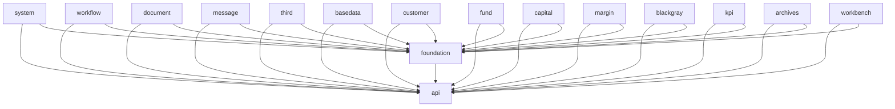
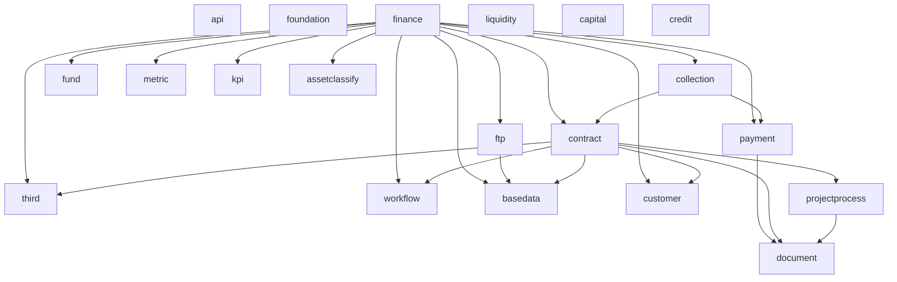
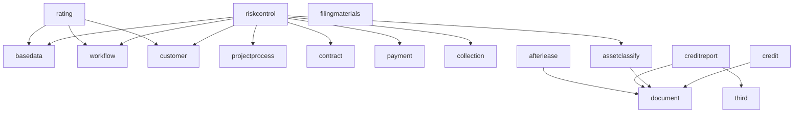

# zswl-mithras 模块语义与依赖关系

本文用于描述当前仓库中各模块的业务语义、模块分层，以及模块之间的依赖关系。依赖关系以当前 Maven POM 中的直接依赖为主；代码层面仍可能存在少量历史包引用，需要在后续重构中继续清理。

模块是否过细、哪些模块适合收敛、以及后续合并顺序见 [模块收敛方案](docs/module-consolidation-plan.md)。

## 总体分层

当前系统可以按四层理解：

1. 底座层：提供公共契约、基础工具、系统能力。
2. 横向能力层：提供流程、文档、消息、第三方集成、基础数据等横向业务能力。
3. 业务域层：客户、项目、合同、付款、收款、资金、风控、租后等具体业务域。
4. 装配编排层：`application` 负责跨域编排和 adapter，`web` 负责启动，`report` 负责报表装配。

理想方向：

- 底座层不依赖业务域。
- 横向能力模块尽量不互相依赖，也不反向适配具体业务域。
- 业务域模块尽量保持语义独立，不直接依赖其他业务域；必要跨域协作通过 port 或 `application` 编排。
- `application` 可以依赖多个业务域，因为它承担装配和跨域协作职责。

## 分层依赖图

## 模块业务语义

### 底座层

| 模块 | 业务语义 | 当前判断 |
| --- | --- | --- |
| `zswl-mithras-api` | 公共 API、DTO、注解、校验器、跨模块请求响应契约。 | 是底层契约包，但目前偏大，混有较多业务 DTO。 |
| `zswl-mithras-foundation` | 通用异常、枚举、工具、上下文、异步、版本、数据对比、基础 port。 | 是基础能力模块，应避免继续承载具体业务语义。 |
| `zswl-mithras-system` | 用户、组织、角色、权限、系统配置、审计日志、下载等系统后台能力。 | 属于底座实现层，可实现 foundation 中的用户/组织 port。 |

### 横向能力层

| 模块 | 业务语义 | 当前判断 |
| --- | --- | --- |
| `zswl-mithras-workflow` | 流程模型、流程实例、任务、动态表单、流程结束事件、流程准备能力。 | 应保持通用流程能力，不直接适配 message 或具体业务域。 |
| `zswl-mithras-document` | 文件、材料清单、模板、OCR、OnlyOffice、文档渲染、材料版本。 | 是文档材料能力模块，应通过 port 获取业务数据。 |
| `zswl-mithras-message` | 站内消息、待办、邮件、钉钉/OA 通知、消息初始化。 | 是通知通道模块，不应反向依赖 workflow 或业务域。 |
| `zswl-mithras-third` | 财务共享、苍穹、天眼查、企查查、OCR、中登、舆情等外部系统集成。 | 是外部集成能力模块，适合作为横向能力。 |
| `zswl-mithras-basedata` | 字典、特殊日期、LPR、汇率、银行账户基础数据和基础数据同步任务。 | 语义较清楚，属于低耦合基础业务数据模块。 |

### 核心业务域

| 模块 | 业务语义 | 当前判断 |
| --- | --- | --- |
| `zswl-mithras-customer` | 客户资料、工商信息、股东、联系人、客户银行账户、关联企业、客户生命周期。 | 核心主数据域，应尽量被其他域通过契约读取。 |
| `zswl-mithras-projectprocess` | 项目立项、项目评审、项目定价、现金流、会议纪要、项目状态和项目版本。 | 核心项目过程域，是业务链路中心之一。 |
| `zswl-mithras-credit` | 集团授信、授信立项/评审、集团授信版本和授信审批材料。 | 授信域，和项目/客户关系密切。 |
| `zswl-mithras-contract` | 合同、起租、变更、提前还款、展期、LPR 调整、还款计划、租赁物/担保/抵质押。 | 核心合同域，当前仍依赖客户、项目、文档、流程等。 |
| `zswl-mithras-payment` | 付款申请、付款实际、付款流程、付款政策、付款问卷、付款核销事件。 | 付款域，当前 POM 已收敛到低耦合状态，合同/客户/流程事实通过本域 port 与 application adapter 输入。 |
| `zswl-mithras-collection` | 收款台账、账单、核销、逾期、罚息、对账函、催收函。 | 收款域，当前仍直接读取合同/付款事实，客户事实已不再作为直接模块依赖。 |
| `zswl-mithras-fund` | 资金融资、融资机构、融资收付、融资还款计划、资金流程、财务系统提交。 | 资金域，当前 POM 依赖较低，但实际业务会被财务/流动性等读取。 |
| `zswl-mithras-capital` | 银行流水、业务流水、财务流水、自动/手工核销、流水释放。 | 资金流水与核销域，语义独立。 |
| `zswl-mithras-finance` | 月度管理、印花税、账龄、逾期报送、项目利润分配、财务报表指标、财务回写。 | 财务域，目前依赖多个业务域，耦合较高。 |
| `zswl-mithras-margin` | 保证金基础信息、抵退、核销、通知、保证金联动。 | 保证金域，目前 POM 低耦合，适合保持独立。 |
| `zswl-mithras-liquidity` | 资金流入、现金流出、短期借款、流动性风险指标。 | 流动性风险域，天然会读取资金/合同/收款等数据。 |
| `zswl-mithras-ftp` | 老版/新版 FTP 定价、月度/季度指导、LPR/SHIBOR、担保成本、融资成本、计息和模板。 | FTP 定价域。old/new 需要并存，客户事实已通过 application adapter 输入。 |
| `zswl-mithras-leaseholdproperty` | 租赁物、台账、评估、车辆登记、发票、OCR、评估机构白名单。 | 租赁物域，和合同语义相邻，但当前 POM 不再直接依赖合同，合同上下文由 application adapter 输入。 |
| `zswl-mithras-afterlease` | 租后检查计划、检查报告、外部信息查询、租后调整、租金催收、罚息减免。 | 租后域，和合同/收款/客户/风控事实相关，但当前 POM 已收敛到低耦合状态。 |

### 风险、评级与监管报送

| 模块 | 业务语义 | 当前判断 |
| --- | --- | --- |
| `zswl-mithras-riskcontrol` | 风控策略、指标计算、预警/舆情、集中度、关联客户、评分卡、风险报告。 | 风控域，目前直接依赖较多核心域，后续适合继续抽查询 port。 |
| `zswl-mithras-rating` | 客户评级、评级额度、区域/城市指标、评级决策引擎集成。 | 评级域，当前仍直接依赖客户/流程/基础数据；项目和风控事实已通过 adapter/port 收窄。 |
| `zswl-mithras-assetclassify` | 资产五级分类、复核、评审会/风委会/董事会流程、风险因子和分类结果。 | 资产分类域，当前 POM 只直接依赖 document，客户/合同/收款/付款事实已通过 adapter 隔离。 |
| `zswl-mithras-creditreport` | 征信查询、征信报告解析、额度、还款责任、异步查询结果。 | 征信域，当前 POM 只保留 third/document 等真实能力依赖，客户/项目/授信/合同/付款/流程事实已通过 port 与 application adapter 收窄。 |
| `zswl-mithras-blackgray` | 黑灰名单、规则配置、入库任务、失信名单、人工出库。 | 黑灰名单域，目前 POM 低耦合，适合保持独立。 |
| `zswl-mithras-associationreport` | 金融局/协会报送、报送模板、报送流程、报送任务。 | 监管/协会报送域，读取大量业务域，属于报送聚合型模块。 |

### 材料、档案、展示与经营管理

| 模块 | 业务语义 | 当前判断 |
| --- | --- | --- |
| `zswl-mithras-filingmaterials` | 归档资料目录、资金端/项目端资料台账、资料下载记录、归档策略。 | 归档资料域，和 document 边界要保持清楚。 |
| `zswl-mithras-archives` | 档案模板、档案管理、档案借阅/下载审批、档案下载权限。 | 档案生命周期域，目前 POM 低耦合。 |
| `zswl-mithras-policy` | 保单信息、暂存、台账、版本、导入导出、续保提醒和保单相关材料。 | 保单/保险管理域，依赖 document 合理；付款阶段保单和正式保单有关联，但不建议直接并入 payment。 |
| `zswl-mithras-budget` | 预算计划、预算执行、收益测算、付息/付款明细、ECL 预测配置。 | 预算/ECL 域，依赖项目、KPI、财务、收款、流程。 |
| `zswl-mithras-kpi` | KPI 参数、绩效管理、项目预测、ECL 业务配置、指标导出和绩效计算。 | KPI 域，目前 POM 低耦合。 |
| `zswl-mithras-dashboard` | 运营、项目、付款、租后、资金、财务管报和看板聚合查询。 | 看板聚合模块，依赖多域是业务特性；当前已去掉 workflow/riskcontrol/assetclassify 等直接依赖。 |
| `zswl-mithras-workbench` | 工作台快捷入口、公告、卡片指标、图表、初始化和指标刷新。 | 工作台模块，目前 POM 低耦合，但应用中会被 adapter 补齐跨域数据。 |
| `zswl-mithras-metric` | 金融云/风控指标、指标因子、指标报表、指标刷新。 | 指标聚合域，依赖多域读取数据；当前已去掉 riskcontrol/customer 等直接或隐藏依赖。 |

### 装配与前端

| 模块 | 业务语义 | 当前判断 |
| --- | --- | --- |
| `zswl-mithras-application` | 跨域编排、facade、adapter、流程动态表单、流程结束处理、事件监听。 | 当前承担“业务域之间的胶水层”，可以依赖多个域。 |
| `zswl-mithras-report` | 征信报送和报表装配模块，直接读取合同、付款、收款、客户、项目、资产分类等事实数据。 | 已去掉对 `application`、`creditreport`、`message` 的直接依赖；仍属于报送侧聚合模块，后续继续收敛 workflow/system 调用。 |
| `zswl-mithras-web` | Spring Boot 启动入口、最终运行包、环境配置和迁移资源。 | 应用装配与启动模块。 |
| `zswl-mithras-react` | React 前端工程。 | 前端工程，不参与 Maven 后端模块依赖。 |

## 业务主链路图

## 当前 POM 直接依赖关系

下面是当前 Maven POM 中的模块直接依赖。`api` 与 `foundation` 是大多数模块的基础依赖，为了完整性仍保留在表中。

| 模块 | 直接依赖的内部模块 |
| --- | --- |
| `zswl-mithras-api` | 无 |
| `zswl-mithras-foundation` | `api` |
| `zswl-mithras-system` | `api`, `foundation` |
| `zswl-mithras-workflow` | `api`, `foundation` |
| `zswl-mithras-document` | `api`, `foundation` |
| `zswl-mithras-message` | `api`, `foundation` |
| `zswl-mithras-third` | `api`, `foundation` |
| `zswl-mithras-basedata` | `api`, `foundation` |
| `zswl-mithras-customer` | `api`, `foundation` |
| `zswl-mithras-projectprocess` | `api`, `foundation`, `document` |
| `zswl-mithras-credit` | `api`, `foundation`, `document` |
| `zswl-mithras-contract` | `api`, `foundation`, `document`, `customer`, `basedata`, `workflow`, `projectprocess`, `third` |
| `zswl-mithras-payment` | `api`, `foundation`, `document` |
| `zswl-mithras-collection` | `api`, `foundation`, `payment`, `contract` |
| `zswl-mithras-fund` | `api`, `foundation` |
| `zswl-mithras-capital` | `api`, `foundation` |
| `zswl-mithras-margin` | `api`, `foundation` |
| `zswl-mithras-liquidity` | `api`, `foundation` |
| `zswl-mithras-finance` | `api`, `foundation`, `collection`, `contract`, `customer`, `third`, `metric`, `basedata`, `workflow`, `fund`, `kpi`, `ftp`, `payment`, `assetclassify` |
| `zswl-mithras-ftp` | `api`, `foundation`, `basedata` |
| `zswl-mithras-leaseholdproperty` | `api`, `foundation`, `document`, `basedata`, `third` |
| `zswl-mithras-afterlease` | `api`, `foundation`, `document` |
| `zswl-mithras-riskcontrol` | `api`, `foundation`, `workflow`, `basedata`, `customer`, `contract`, `projectprocess`, `assetclassify`, `payment`, `collection` |
| `zswl-mithras-rating` | `api`, `foundation`, `basedata`, `customer`, `workflow` |
| `zswl-mithras-assetclassify` | `api`, `foundation`, `document` |
| `zswl-mithras-creditreport` | `api`, `foundation`, `third`, `document` |
| `zswl-mithras-blackgray` | `api`, `foundation` |
| `zswl-mithras-associationreport` | `api`, `foundation`, `basedata` |
| `zswl-mithras-filingmaterials` | `api`, `foundation`, `document` |
| `zswl-mithras-archives` | `api`, `foundation` |
| `zswl-mithras-policy` | `api`, `foundation`, `document` |
| `zswl-mithras-budget` | `api`, `foundation`, `projectprocess`, `kpi`, `finance`, `contract`, `payment` |
| `zswl-mithras-kpi` | `api`, `foundation` |
| `zswl-mithras-dashboard` | `api`, `foundation`, `basedata`, `customer`, `afterlease`, `contract`, `payment`, `fund`, `kpi`, `projectprocess` |
| `zswl-mithras-workbench` | `api`, `foundation` |
| `zswl-mithras-metric` | `api`, `foundation`, `third`, `basedata`, `projectprocess`, `contract`, `fund`, `kpi`, `payment`, `collection`, `assetclassify` |
| `zswl-mithras-application` | 几乎所有业务域与横向能力模块 |
| `zswl-mithras-report` | `api`, `foundation`, `system`, `basedata`, `contract`, `workflow`, `customer`, `projectprocess`, `payment`, `collection` |
| `zswl-mithras-web` | `application`, `system`, `report` |
| `zswl-mithras-react` | 后端 POM 外的前端工程 |

## 依赖关系图：低耦合底座与横向能力

这些模块当前 POM 依赖较少，适合作为后续“干净模块”的参照。需要注意：POM 低耦合不等于代码层完全低耦合，仍要结合 import 和实际业务调用检查。

## 依赖关系图：核心交易链路

观察：

- `contract`、`payment`、`collection` 形成核心交易链路；当前 `payment` 已在 POM 层与合同/客户/流程解耦，`collection` 仍直接依赖合同/付款事实。
- `ftp` 经过近期整理后，已从 workflow/document/payment/fund/contract/customer/projectprocess 等依赖中拆出，目前只保留对 `basedata` 的业务能力依赖；客户主体定价分类和项目过程分类由 `application` adapter 或稳定值传入 FTP。
- `finance` 是高聚合读取模块，依赖多个交易域，后续要判断哪些是业务事实读取，哪些应迁到 `application` adapter。
- `liquidity` 已把 `basedata`、`collection`、`fund` 等外域输入收敛为 snapshot/port，Maven 层只保留 `api`、`foundation`，跨域装载留在 `application` adapter。

## 依赖关系图：风险、评级、征信、租后

观察：

- 风险、评级、征信、租后都需要读取核心交易事实，因此依赖较容易膨胀。
- 当前 `rating`、`creditreport`、`assetclassify`、`afterlease` 已完成一批 POM 层收敛，很多外域事实读取改由 port 或 `application` adapter 承接；后续重点是继续查资源层 SQL 和残留 Java import。

## 依赖关系图：材料、报表、经营管理

```mermaid
flowchart TD
    document[document]
    workflow[workflow]
    basedata[basedata]
    customer[customer]
    project[projectprocess]
    contract[contract]
    payment[payment]
    collection[collection]
    fund[fund]
    asset[assetclassify]
    risk[riskcontrol]
    rating[rating]
    ftp[ftp]
    finance[finance]
    kpi[kpi]
    dashboard[dashboard]
    metric[metric]
    budget[budget]
    association[associationreport]
    filing[filingmaterials]
    archives[archives]
    policy[policy]
    workbench[workbench]

    filing --> document
    policy --> document

    budget --> project
    budget --> kpi
    budget --> finance
    budget --> contract
    budget --> payment

    dashboard --> basedata
    dashboard --> customer
    dashboard --> afterlease
    dashboard --> contract
    dashboard --> payment
    dashboard --> fund
    dashboard --> kpi
    dashboard --> project

    metric --> third
    metric --> basedata
    metric --> project
    metric --> contract
    metric --> fund
    metric --> kpi
    metric --> payment
    metric --> collection
    metric --> asset

    association --> basedata
```

观察：

- `dashboard`、`metric`、`associationreport` 是典型聚合查询/报送模块，但 `associationreport` 已把对 contract、payment、collection、rating、assetclassify、dashboard、metric、fund 等外域事实读取改成 application adapter 适配。
- `dashboard` 已去掉 workflow/riskcontrol/assetclassify 的 POM 直接依赖，`metric` 已去掉 riskcontrol/customer 的直接或隐藏依赖；它们仍是读侧聚合模块，治理重点不是物理合并，而是继续把外域事实输入快照化。
- 这类模块不应被核心业务域反向依赖，否则会形成环状业务语义。
- `filingmaterials`、`archives`、`document` 三者需要持续明确边界：`document` 是文件能力，`filingmaterials` 是归档资料业务，`archives` 是档案生命周期。

## 依赖关系图：装配层

```mermaid
flowchart TD
    web[web]
    report[report]
    app[application]

    app --> creditreport
    app --> associationreport
    app --> kpi
    app --> rating
    app --> blackgray
    app --> capital
    app --> finance
    app --> fund
    app --> leaseholdproperty
    app --> liquidity
    app --> basedata
    app --> margin
    app --> policy
    app --> credit
    app --> assetclassify
    app --> filingmaterials
    app --> archives
    app --> ftp
    app --> projectprocess
    app --> payment
    app --> afterlease
    app --> budget
    app --> customer
    app --> contract
    app --> collection
    app --> riskcontrol
    app --> workbench
    app --> third
    app --> message
    app --> dashboard
    app --> workflow
    app --> document
    app --> metric
    app --> system

    report --> contract
    report --> workflow
    report --> payment
    report --> collection
    report --> customer
    report --> projectprocess

    web --> app
    web --> system
    web --> report
```

观察：

- `application` 目前是全局编排层，依赖很多模块是预期内的。
- 业务域之间如果必须协作，优先让 `application` 实现 adapter，而不是让横向能力或业务域互相硬依赖。
- `web` 只应负责启动装配，不承载业务逻辑。

## 当前主要结构问题

1. 业务域之间直接依赖仍偏多，尤其是 `contract`、`payment`、`collection`、`riskcontrol`、`afterlease`、`finance`。
2. 横向能力模块的方向已经更清楚：`workflow` 不应直接依赖 `message`，`message` 也不应适配 `workflow`；二者之间的业务连接应放在 `application`。
3. `application` 变大是当前阶段的合理代价，它承接了拆业务域依赖时迁出的 adapter、listener、flow handler。
4. 一些共享业务枚举仍分散在业务域中，被其他域引用。后续要判断这些枚举是“某域语义”还是“全局分类语义”，再决定是否迁到 `foundation` 或保留在原域。
5. 报表、看板、指标、协会报送这类聚合模块天然依赖多域，不应按核心交易域的低耦合标准机械处理。

## 后续整理原则

1. 优先选择实际依赖较少的模块整理，既看 POM 直接依赖，也看依赖的依赖和代码 import。
2. 模块内先清理 package、无效 import、无效 POM 依赖，再判断是否需要迁移文件。
3. 能直接迁的类直接迁；迁不过去的先留在 `application`，不要为了纯净强行抽象。
4. 当目标是解除业务域互相依赖、且直接迁移会导致反向依赖时，可以抽新 port。
5. `oldftp` 与 `newftp` 保留并存，避免为了整理结构破坏历史业务兼容。
6. 每轮改动后批量编译相关模块，不做每迁一个文件就编译一次的低效验证。
