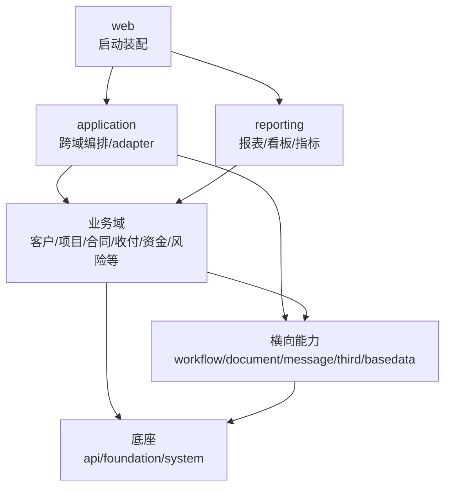

# zswl-mithras 架构索引

本仓库当前包含 39 个后端 Maven 子模块，以及一个前端工程。模块边界正在从“历史物理拆分”收敛为“业务语义清楚、依赖方向明确”的结构。

## 架构文档

- [当前模块地图](docs/module-map.md)：按当前代码重新梳理各模块业务语义、分层、POM 依赖、实际依赖闭包和主要耦合关系。
- [模块收敛方案](docs/module-consolidation-plan.md)：记录模块是否过细、哪些模块适合保持独立、哪些模块需要依赖瘦身或合并准备，以及已完成的治理动作。
- [模块包名体检](docs/module-package-review.md)：检查各模块内部 package/class 命名、历史命名信号、空目录和后续重构优先级。

## 当前判断

当前不建议为了减少 Maven 数量而立即大规模物理合并模块。更稳妥的方向是：

- 底座和横向能力保持低耦合。
- 业务域之间尽量不直接依赖持久化模型或 mapper。
- 跨域事实装配放在 `zswl-mithras-application`。
- 业务域通过自有 port、snapshot 或稳定 DTO 表达外部输入。
- 等模块语义和依赖方向稳定后，再选择生命周期确实重合的模块做小步物理合并试点。

## 总体分层

## 推进原则

1. 先基于当前代码证据判断边界，不只看 POM。
2. 低风险模块先做清理，高风险聚合模块先做分析和 port 收敛。
3. 业务域不是不能有交互，而是交互应通过稳定契约，不应互相读取内部表模型。
4. `application` 允许高依赖，但只应承载跨域编排、adapter、事件监听、流程/消息/文档接线。
5. `web` 只负责启动和运行装配。
