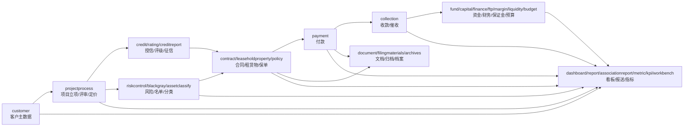

# 当前模块地图

本文基于当前工作区代码重新梳理 `zswl-mithras` 的模块语义和模块间关系。它描述的是“当前事实”，不是理想设计。

证据口径：

- POM 直接依赖：来自各子模块 `pom.xml`。
- 实际依赖闭包：从 POM 直接依赖递归展开，排除 `api`、`foundation` 后统计。
- Java import：来自 `src/main/java` 中的 `cn.zswltech.mithras.*` import。
- resources/SQL：用于识别 POM/Java 看不到的表级耦合。

注意：POM 低耦合不等于业务完全干净；Mapper XML、SQL 初始化脚本、application adapter 以及流程/菜单资源也会体现真实边界。

## 一句话结论

当前模块划分偏细，但还不适合立刻大规模物理合并。更可靠的阶段目标是把模块先收敛成语义干净的业务域：业务域之间少直接依赖，横向能力不反向适配业务域，跨域事实由 `application` 装配。

## 分层视图

| 层级 | 模块 | 语义 |
| --- | --- | --- |
| 底座层 | `api`, `foundation`, `system` | 公共契约、基础工具、用户组织权限和系统配置。 |
| 横向能力层 | `workflow`, `document`, `message`, `third`, `basedata` | 流程、文档、消息、第三方集成、基础数据。 |
| 核心事实源 | `customer`, `projectprocess`, `contract`, `payment`, `collection`, `fund`, `capital`, `margin`, `liquidity`, `finance`, `ftp` | 客户、项目、合同、收付、资金、财务、定价等核心业务事实。 |
| 风险授信域 | `credit`, `rating`, `creditreport`, `riskcontrol`, `assetclassify`, `blackgray` | 授信、评级、征信、风控、资产分类、黑灰名单。 |
| 材料档案域 | `document`, `filingmaterials`, `archives`, `policy`, `leaseholdproperty` | 文件能力、归档资料、正式档案、保单、租赁物。 |
| 经营管理/报表域 | `budget`, `kpi`, `metric`, `dashboard`, `report`, `associationreport`, `workbench`, `afterlease` | 预算绩效、指标、看板、报送、工作台、租后。 |
| 装配层 | `application`, `web` | 跨域编排/adapter 和启动装配。 |

## 目标业务域归组

| 目标大域 | 当前模块 | 当前建议 |
| --- | --- | --- |
| platform | `api`, `foundation`, `system`, `basedata` | 保持独立。`api` 偏大，后续继续控制业务 DTO 外溢。 |
| horizontal-capability | `workflow`, `document`, `message`, `third` | 保持独立。横向能力之间尽量不互相依赖，业务接线交给 `application`。 |
| customer | `customer` | 客户主数据域，保持独立。 |
| project | `projectprocess` | 项目过程域，保持独立。 |
| contract | `contract`, `leaseholdproperty`, `policy` | 语义相邻，但都有独立生命周期，先不合并。 |
| finance | `payment`, `collection`, `fund`, `capital`, `finance`, `ftp`, `liquidity`, `margin`, `budget` | 财务资金大域候选。先依赖瘦身，不急物理合并。 |
| risk-credit | `credit`, `creditreport`, `rating`, `riskcontrol`, `assetclassify`, `blackgray` | 风险授信大域候选。保持各子域独立，继续清理直接事实读取。 |
| records | `document`, `filingmaterials`, `archives` | 职责不同：文件能力、归档准备、正式档案。暂不合并。 |
| reporting | `report`, `associationreport`, `dashboard`, `metric`, `kpi`, `workbench` | 读侧聚合和报送展示域。核心业务不应反向依赖它们。 |
| assembly | `application`, `web` | `application` 做跨域装配，`web` 做启动。 |

## 业务主链路

## 模块语义

| 模块 | Java 文件数 | 业务语义 | 当前边界判断 |
| --- | ---: | --- | --- |
| `api` | 3094 | 公共 API、DTO、注解、跨模块契约。 | 底座契约包，但过大，混有大量业务 DTO。 |
| `foundation` | 175 | 通用异常、枚举、工具、上下文、异步、版本、数据对比、基础 port。 | 底座能力，已基本清理为基础包。 |
| `system` | 72 | 用户、组织、角色、权限、系统配置、审计日志。 | 底座实现层，可实现 foundation 中用户/组织 port。 |
| `basedata` | 43 | 字典、特殊日期、LPR、汇率、银行账户基础数据。 | 基础业务数据，低耦合。 |
| `workflow` | 110 | 流程模型、实例、任务、流程准备与结束事件。 | 横向流程能力，不应直接接 message 或具体业务域。 |
| `document` | 59 | 文件、模板、OnlyOffice、材料版本、文档渲染基础能力。 | 横向文档能力，通过 port 获取业务数据。 |
| `message` | 58 | 站内消息、待办、邮件、钉钉/OA 通知。 | 横向通知能力，不应适配 workflow/业务域。 |
| `third` | 407 | 财务共享、苍穹、天眼查、企查查、OCR、中登、舆情等外部集成。 | 横向外部集成能力。 |
| `customer` | 400 | 客户资料、工商、联系人、银行账户、关联企业、客户生命周期。 | 客户主数据事实源，应通过契约被读取。 |
| `projectprocess` | 341 | 项目立项、评审、定价、现金流、会议纪要、项目状态与版本。 | 核心项目过程事实源。 |
| `contract` | 557 | 合同、起租、变更、提前还款、展期、LPR 调整、还款计划、担保抵质押。 | 核心交易中枢，当前仍高耦合。 |
| `payment` | 135 | 付款申请、付款实际、付款政策、付款核销事件。 | 已收敛为低耦合付款域，外部事实通过 port 输入。 |
| `collection` | 87 | 收款台账、账单、核销、逾期、罚息、对账函、催收函。 | 收款事实源，仍真实依赖合同/付款。 |
| `fund` | 402 | 资金融资、融资机构、融资收付、资金流程。 | 资金事实源，POM 低耦合。 |
| `capital` | 50 | 银行流水、业务流水、财务流水、自动/手工核销、流水释放。 | 资金流水与核销域，POM 低耦合；application 中仍有编排外溢。 |
| `finance` | 220 | 月度管理、印花税、账龄、逾期报送、项目利润分配、财务报表指标。 | 财务聚合域，依赖重，适合继续事实输入快照化。 |
| `ftp` | 366 | 老版/新版 FTP 定价、月度/季度指导、LPR/SHIBOR、担保和融资成本。 | 定价域，old/new 并存合理。 |
| `margin` | 40 | 保证金、质保金、收退、核销、通知。 | 保证金域，低耦合。 |
| `liquidity` | 125 | 资金流入/流出、短期借款、流动性指标。 | 流动性风险/资金域，当前 POM 低耦合。 |
| `credit` | 80 | 集团授信、授信立项/评审、额度创建/占用/释放。 | 授信事实域，低耦合。 |
| `rating` | 69 | 客户评级、债项评级、评级额度、评级决策。 | 评级域，仍直接读取少量客户/流程/基础数据。 |
| `creditreport` | 231 | 征信查询、征信报告解析、额度、还款责任、异步查询结果。 | 征信域，主要依赖 third/document。 |
| `riskcontrol` | 208 | 风控策略、指标、预警/舆情、集中度、关联客户、评分卡、风险报告。 | 风控运营域，剩余外域读取集中在大报表、名单同步和敞口计算。 |
| `assetclassify` | 79 | 资产五级分类、复核、评审会/风委会/董事会、分类结果。 | 资产分类域，外部事实已通过 port/application 收窄。 |
| `blackgray` | 201 | 黑灰名单、规则配置、入库任务、失信名单、人工出库。 | 黑灰名单域，Java/POM 低耦合，保持独立。 |
| `leaseholdproperty` | 107 | 租赁物、台账、评估、车辆登记、发票、评估机构白名单。 | 合同相邻域，但有独立生命周期，暂不合并。 |
| `policy` | 55 | 保单、暂存、台账、版本、续保提醒、保单材料。 | 保单域，依赖 document 合理，暂不并入 payment/contract。 |
| `afterlease` | 251 | 租后检查、外部查询、租后调整、催收、罚息减免。 | 租后域，直接 POM 已低耦合。 |
| `filingmaterials` | 53 | 归档资料目录、资料台账、下载记录、归档策略。 | 归档准备域，和 document/archives 边界需继续保持。 |
| `archives` | 27 | 档案模板、档案管理、档案借阅/下载审批。 | 档案生命周期域，低耦合。 |
| `budget` | 155 | 预算计划、执行、收益测算、付款明细、ECL 预测配置。 | 预算/ECL 域，第一轮直接依赖隔离后低耦合。 |
| `kpi` | 206 | KPI 参数、绩效管理、项目预测、ECL 业务配置。 | KPI 域，低耦合。 |
| `metric` | 409 | 金融云/风控指标、指标因子、指标报表、刷新任务。 | 指标聚合域，真实依赖多个事实源。 |
| `dashboard` | 305 | 运营、项目、付款、租后、资金、财务管报和看板。 | 看板聚合模块，依赖多域是业务特性。 |
| `report` | 240 | 征信报送和监管口径快照。 | 报送聚合模块，读取大量交易事实。 |
| `associationreport` | 238 | 金融局/协会报送、报送模板、任务、SFTP 报送。 | 监管/协会报送域，直接 POM 低耦合但业务上是报送聚合。 |
| `workbench` | 105 | 工作台快捷入口、公告、卡片指标、图表、刷新任务。 | 工作台读侧入口，POM 低耦合。 |
| `application` | 1070 | 跨域 facade、adapter、流程动态表单、事件监听、消息/文档/第三方接线。 | 装配层，依赖多符合定位；应避免承载单域实现。 |
| `web` | 5 | Spring Boot 启动入口和运行装配。 | 启动模块。 |

## 当前 POM 直接依赖

下表只列内部模块依赖，并省略 `zswl-mithras-` 前缀。

| 模块 | 直接依赖 |
| --- | --- |
| `afterlease` | `api`, `foundation`, `document` |
| `api` | 无 |
| `application` | `api`, `foundation`, `creditreport`, `associationreport`, `kpi`, `rating`, `blackgray`, `capital`, `finance`, `fund`, `leaseholdproperty`, `liquidity`, `basedata`, `margin`, `policy`, `credit`, `assetclassify`, `filingmaterials`, `archives`, `ftp`, `projectprocess`, `payment`, `afterlease`, `budget`, `customer`, `contract`, `collection`, `riskcontrol`, `workbench`, `third`, `message`, `dashboard`, `workflow`, `document`, `metric`, `system` |
| `archives` | `api`, `foundation` |
| `assetclassify` | `api`, `foundation`, `document` |
| `associationreport` | `api`, `foundation`, `basedata` |
| `basedata` | `api`, `foundation` |
| `blackgray` | `api`, `foundation` |
| `budget` | `api`, `foundation` |
| `capital` | `api`, `foundation` |
| `collection` | `api`, `foundation`, `payment`, `contract` |
| `contract` | `api`, `foundation`, `document`, `customer`, `basedata`, `workflow`, `projectprocess`, `third` |
| `credit` | `api`, `foundation`, `document` |
| `creditreport` | `api`, `foundation`, `third`, `document` |
| `customer` | `api`, `foundation` |
| `dashboard` | `api`, `foundation`, `basedata`, `customer`, `afterlease`, `contract`, `payment`, `fund`, `kpi`, `projectprocess` |
| `document` | `api`, `foundation` |
| `filingmaterials` | `api`, `foundation`, `document` |
| `finance` | `api`, `foundation`, `collection`, `contract`, `customer`, `third`, `metric`, `basedata`, `workflow`, `fund`, `kpi`, `ftp`, `payment`, `assetclassify` |
| `foundation` | `api` |
| `ftp` | `api`, `foundation`, `basedata` |
| `fund` | `api`, `foundation` |
| `kpi` | `api`, `foundation` |
| `leaseholdproperty` | `api`, `foundation`, `document`, `basedata`, `third` |
| `liquidity` | `api`, `foundation` |
| `margin` | `api`, `foundation` |
| `message` | `api`, `foundation` |
| `metric` | `api`, `foundation`, `third`, `basedata`, `projectprocess`, `contract`, `fund`, `kpi`, `payment`, `collection`, `assetclassify` |
| `payment` | `api`, `foundation`, `document` |
| `policy` | `api`, `foundation`, `document` |
| `projectprocess` | `api`, `foundation`, `document` |
| `rating` | `api`, `foundation`, `basedata`, `customer`, `workflow` |
| `report` | `api`, `foundation`, `system`, `basedata`, `contract`, `workflow`, `customer`, `projectprocess`, `payment`, `collection` |
| `riskcontrol` | `api`, `foundation`, `customer`, `contract`, `projectprocess`, `payment`, `collection` |
| `system` | `api`, `foundation` |
| `third` | `api`, `foundation` |
| `web` | `application`, `system`, `report` |
| `workbench` | `api`, `foundation` |
| `workflow` | `api`, `foundation` |

## 实际依赖闭包

闭包统计从 POM 依赖递归展开，排除 `api`、`foundation`。这反映构建层面会被一起拉入的业务/横向模块。

| 闭包规模 | 模块 | 判断 |
| --- | --- | --- |
| 0 | `archives`, `basedata`, `blackgray`, `budget`, `capital`, `customer`, `document`, `fund`, `kpi`, `liquidity`, `margin`, `message`, `system`, `third`, `workbench`, `workflow` | 构建层低耦合。仍需结合 SQL/resources/application 外溢判断是否真正干净。 |
| 1 | `afterlease`, `assetclassify`, `associationreport`, `credit`, `filingmaterials`, `ftp`, `payment`, `policy`, `projectprocess` | 多数只依赖 `document` 或 `basedata`，属于轻依赖模块。 |
| 2-3 | `creditreport`, `leaseholdproperty`, `rating` | 有明确横向能力或上游事实输入，仍可独立。 |
| 6-11 | `collection`, `contract`, `dashboard`, `report`, `riskcontrol` | 核心交易或读侧聚合模块，治理重点是收敛外域事实读取。 |
| 12+ | `application`, `finance`, `metric`, `web` | 装配层或高耦合聚合模块。`application/web` 依赖多符合定位；`finance/metric` 需要继续事实输入快照化。 |

## Java import 热点

当前 Java import 说明：

- `application` 是最大装配层，直接 import 约覆盖所有业务域：`contract`、`fund`、`customer`、`projectprocess`、`workflow`、`payment`、`document` 等都很高。这符合其 adapter/facade 定位，但也提示单域实现仍有外溢。
- `contract` 仍直接 import `projectprocess` 约 33 处、`customer` 约 31 处、`third` 约 22 处、`workflow` 约 8 处，是交易链路核心高耦合模块。
- `collection` 仍直接 import `contract` 约 14 处、`payment` 约 6 处，是收款事实和合同/付款事实交叉点。
- `finance` 仍直接 import `contract` 约 30 处、`third` 约 21 处、`collection` 约 14 处、`workflow` 约 13 处、`kpi` 约 12 处、`metric` 约 8 处，是财务聚合域。
- `metric` 仍直接 import `fund` 约 64 处、`contract` 约 45 处、`payment` 约 34 处、`projectprocess` 约 15 处、`collection` 约 14 处、`assetclassify` 约 11 处，是指标聚合域。
- `report` 仍直接 import `contract` 约 129 处、`payment` 约 64 处、`customer` 约 43 处、`collection` 约 37 处、`projectprocess` 约 12 处，是征信报送快照聚合域。
- `riskcontrol` 已收敛很多，剩余直接 import 约为 `customer` 11、`collection` 7、`payment` 6、`contract` 6、`projectprocess` 2；剩余点集中在 JZD 报表、客户名单同步、剩余本金计算。
- `dashboard` 仍直接 import `payment`、`kpi`、`contract`、`afterlease` 各约 14 处，`projectprocess` 约 11 处，属于看板读侧聚合。
- `blackgray`、`budget`、`capital`、`fund`、`kpi`、`liquidity`、`margin`、`message`、`workbench` 等 Java 层基本没有其他业务域 import。

## resources/SQL 层关系

POM 和 Java import 之外，还需要关注资源层：

- `blackgray` Java/POM 很干净，但 Mapper XML 仍读 `audit_task`、`concentration_report`、`bifrost_org`，SQL 初始化脚本写平台菜单表。
- `riskcontrol` 的预警/舆情 Mapper XML 仍 join `client`、`bifrost_org`，属于风险运营读模型耦合。
- `policy` POM/Java 很轻，但 `PolicyInfoMapper.xml` 仍有读取项目、付款、合同表的查询残留。
- `report`、`dashboard`、`metric`、`finance` 这类聚合模块的 SQL 跨表读取是业务特性，治理重点不是完全消灭，而是不要让核心写域反向依赖它们。
- `application/src/main/resources/mapper` 是当前跨域读侧 SQL 的集中地，后续要继续拆成 owner domain snapshot/port，避免变成新的 SQL 聚合垃圾桶。

## 当前问题

1. 模块物理数量偏多，但大多数小模块已经有清晰业务语义，不能机械合并。
2. `application` 承担了正确的跨域装配职责，但仍混有一些单域实现，后续需要逐步回迁。
3. `contract`、`finance`、`metric`、`report`、`dashboard`、`riskcontrol` 是当前依赖治理重点。
4. `api` 过大，业务 DTO 很多，短期作为公共契约接受，长期需要控制新增内容。
5. 横向能力模块应保持“被业务域调用”，而不是反向适配业务域。`workflow/message/document/third` 的业务 key、模板、消息类型等资源仍有业务名称污染，需要长期治理。

## 是否需要合并

需要把“合并”作为目标之一，但不是现在立刻大规模执行。

当前更合适的策略：

- **保持独立**：`customer`、`projectprocess`、`contract`、`payment`、`collection`、`fund`、`credit`、`riskcontrol`、`assetclassify`、`blackgray`、`document`、`workflow`、`message`、`third` 等有明确生命周期的模块。
- **继续依赖瘦身**：`contract`、`collection`、`finance`、`metric`、`report`、`dashboard`、`riskcontrol`。
- **合并准备观察**：`capital`、`liquidity`、`margin`、`policy`、`leaseholdproperty`、`archives`、`filingmaterials` 等较小模块。它们暂不满足低风险物理合并条件，因为仍有独立写模型或生命周期。
- **不作为业务合并对象**：`application`、`web`。它们是装配层。

## 下一步治理队列

| 优先级 | 队列 | 目标 |
| --- | --- | --- |
| P0 | `application` 单域实现外溢 | 把只操作单一业务域模型/mapper/service 的实现回迁，保留跨域 facade、adapter、事件监听和流程/消息/文档接线。 |
| P1 | `contract` 外域事实读取 | 项目、客户、流程、第三方事实逐步快照化或 port 化，避免合同域继续成为大而全模块。 |
| P1 | `metric` 指标输入 | 把 fund/contract/payment/collection/projectprocess/assetclassify 等输入逐步抽成 metric 自有 fact port。 |
| P1 | `finance` 财务聚合 | 区分财务自有写模型和跨域读模型，把 metric/kpi/workflow/assetclassify 等输入收窄。 |
| P1 | `report/dashboard` 读侧 SQL | 保留读侧聚合定位，但避免核心域反向依赖，逐步把粗 SQL 拆成稳定快照输入。 |
| P2 | 横向能力业务污染 | workflow/message/document/third 中的业务 key、模板、消息类型逐步由业务域或 application 注册/适配。 |
| P3 | 物理合并试点 | 只在模块无独立写生命周期、反向依赖少、依赖已瘦身后进行。当前暂无成熟试点。 |
